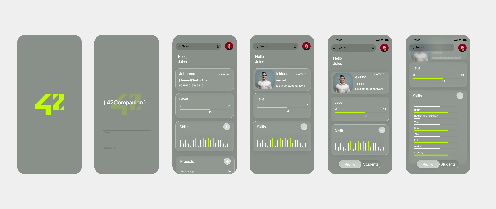

# Swifty Companion

A native iOS client for the 42 Network, engineered to provide a seamless and secure interface for accessing student data and intra-cluster services. This application leverages modern Swift concurrency and a strict MVVM architecture to deliver a high-performance, maintainable codebase that interacts directly with the 42 API.



## Technical Overview

Swifty Companion is built as a demonstration of professional iOS development standards, focusing on robust data handling, security, and architectural purity.

### Core Technologies

- **Swift 5.0+**: Utilizing the latest language features including structured concurrency.
- **SwiftUI**: Declarative UI framework for constructing a reactive and adaptive user interface.
- **Combine**: Used for handling asynchronous events and data streams within the ViewModel layer.
- **Xcode Current**: Developed and tested on the latest stable tooling.

### Key Features & Implementation Details

#### 1. OAuth 2.0 Authentication & Security
The application implements a full OAuth 2.0 authentication flow, ensuring secure user sessions without exposing credentials.
- **ASWebAuthenticationSession**: Utilizes the native system authentication session for a secure, sandboxed login experience.
- **Deep Linking & Callbacks**: Handles custom URL scheme callbacks (`swiftycompanion://`) to capture authorization codes safely.
- **Token Exchange**: Automates the exchange of authorization codes for Access and Refresh tokens via secure POST requests.
- **Session Management**: Encapsulates token lifecycle management, handling expiration and re-authentication transparently.

#### 2. Advanced Networking & Data Handling
The networking layer is designed to be resilient and efficient.
- **Async/Await Concurrency**: All network operations utilize Swift's modern structured concurrency model (`async`/`await`) for non-blocking execution and improved readability over closure-based callbacks.
- **Type-Safe API Interaction**: Network responses are mapped directly to native Swift structures using `Codable` and `JSONDecoder`, ensuring runtime safety and strict schema validation.
- **Error Handling**: Comprehensive error propagation ensures that network failures, parsing errors, or API rate limits are handled gracefully and communicated to the user.

#### 3. Architectural Design (MVVM)
The project adheres to the Model-View-ViewModel pattern to ensure a clean separation of concerns:
- **Model**: Immutable data structures (e.g., `User`, `Token`) representing the API schema.
- **ViewModel**: Actors and classes (e.g., `LoginVM`, `Api42VM`) that manage state, execute business logic, and expose data to the view.
- **View**: Purely presentational components that observe ViewModel state updates.

## Installation

1. **Clone the Repository**
   ```bash
   git clone https://github.com/julesrb/Swifty-Companion.git
   ```

2. **Configuration**
   The application requires valid API credentials to function.
   - Navigate to the project root.
   - Rename `Secrets.example.plist` to `Secrets.plist`.
   - Populated the `UID` and `SECRET` fields with your 42 API application credentials.

3. **Compilation**
   - Open `Swifty-Companion.xcodeproj` in Xcode.
   - Ensure the deployment target is set to iOS 15.0 or higher.
   - Build and run on a Simulator or physical device.
